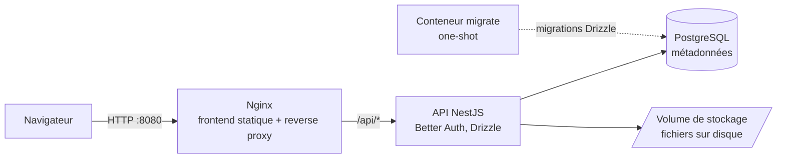

# Nimbus

> Un « Google Drive personnel » auto-hébergé, conçu pour tourner sur un vieux portable recyclé en serveur domestique (Intel i5 de 5ᵉ génération, 8 Go de RAM).


<!-- Capture d'écran : ajouter docs/screenshots/explorer.png puis décommenter

-->

## Pourquoi ce projet

Stocker ses fichiers sur son propre matériel plutôt que chez un tiers, sans sacrifier le confort d'un vrai drive : explorateur, glisser-déposer, aperçus, corbeille, partage multi-utilisateurs. La contrainte forte est la machine cible : **tout le stack (base de données, API, frontend, proxy) doit tenir dans un budget mémoire d'environ 1 Go**.

## Fonctionnalités

- **Explorateur de fichiers** : arborescence de dossiers, création, renommage, déplacement (avec prévention des cycles), vue adaptée au mobile
- **Upload en streaming** directement sur disque, sans charger le fichier en RAM, y compris l'**upload de dossiers entiers** avec leur arborescence
- **Téléchargement** de fichiers, ou de dossiers complets sous forme d'archive ZIP générée à la volée
- **Aperçu** des images et des PDF dans une visionneuse plein écran
- **Corbeille** avec restauration, et **purge automatique** des éléments de plus de 7 jours (tâche planifiée)
- **Favoris**, **journal d'activité**, **propriétés** des fichiers et dossiers, indicateur d'**espace disque**
- **Authentification** par session (Better Auth), avec des **inscriptions soumises à validation** par un administrateur
- **Espace d'administration** : ajout, modification, blocage et suppression d'utilisateurs, réinitialisation de mot de passe
- **Isolation stricte** : un utilisateur ne peut ni voir, ni modifier, ni supprimer les données d'un autre (réponse 404)
- Thème **clair / sombre** automatique

## Architecture



- **Un seul point d'entrée** : Nginx sert le build React statique et proxifie `/api/*`. L'API n'est jamais exposée directement.
- **Fichiers sur disque, métadonnées en base** : PostgreSQL ne stocke que le nom, la taille, le type et le chemin. Les contenus vivent dans un volume dédié.
- **Budget mémoire par conteneur** (`mem_limit`) : Postgres 400 Mo, API 300 Mo, Nginx 64 Mo, avec un Postgres réglé pour une faible consommation.
- **Build hors du serveur** : les images Docker sont construites sur le poste de développement puis transférées, la machine cible ne compile jamais rien.

## Stack technique

| Couche | Technologies |
|---|---|
| Backend | NestJS 12, TypeScript strict, Express 5, Better Auth (plugin admin), Drizzle ORM, class-validator, Joi (validation de l'environnement), `@nestjs/schedule`, archiver |
| Frontend | React 19, Vite 8, React Router 7, client Better Auth, CSS vanilla avec design tokens |
| Données | PostgreSQL, migrations SQL versionnées (Drizzle Kit) |
| Infra | Docker Compose (dev et prod), Nginx, Tailscale pour l'accès distant, service systemd |
| Qualité | Vitest (tests unitaires et e2e), oxlint |

## Démarrage rapide (Docker)

```bash
git clone https://github.com/MaestroAiman/nimbus.git
cd nimbus/infra
cp .env.prod.example .env.prod   # mot de passe Postgres + BETTER_AUTH_SECRET (openssl rand -base64 32)
docker compose --env-file .env.prod -p nimbus-prod -f docker-compose.prod.yml up -d --build
```

L'application est ensuite disponible sur **http://localhost:8080**. Au démarrage, Docker lance Postgres, puis les migrations, puis l'API et enfin le frontend, chacun avec un healthcheck.

Pour développer sans Docker, avec rechargement à chaud : voir le [guide de développement](docs/developpement.md).

## Tests

```bash
cd apps/api
npm run test:all   # unitaires + e2e (nécessite Postgres démarré)
```

Les tests e2e couvrent le flux d'authentification complet, l'arborescence, l'upload d'un fichier de plusieurs dizaines de Mo, le téléchargement, le déplacement et la suppression, la prévention des cycles de dossiers, les transferts de dossiers et **l'isolation entre utilisateurs**.

## Exploitation

- **Healthchecks** : `GET /api/health`, plus un `HEALTHCHECK` Docker sur l'API et le frontend (redémarrage automatique si `unhealthy`)
- **Sauvegardes** : `infra/scripts/backup.sh` (dump Postgres + archive du stockage, horodatés, avec rotation) et `infra/scripts/restore.sh`
- **Déploiement sur le serveur domestique** (Xubuntu, Docker, Tailscale, systemd, swap) : [docs/deploiement-dell.md](docs/deploiement-dell.md)

## Structure du dépôt

```
nimbus/
├── apps/
│   ├── api/     # NestJS : auth, folders, files, trash, favorites, activity, storage
│   └── web/     # React : explorateur, corbeille, suivis, compte, administration
├── infra/       # docker-compose dev/prod, nginx, scripts de sauvegarde
└── docs/        # guide de développement, procédure de déploiement
```

---

Réalisé par [**Aiman**](https://github.com/MaestroAiman), élève ingénieur Data Science & Software Engineering à l'ENSIAS.
